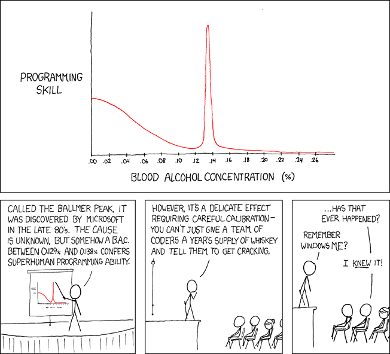

# Boozie


The ideal programming language for pursuing the Ballmer Peak. Compiles to JavaScript.

### Summary

There exists a legend in the world of programming known as the Ballmer Peak. This fabled phenomenon grants a significant "level-up" with respect to coding abilities at a particular range of blood alcohol content (BAC). Yet this territory of productivity is elusive, operating at a very narrow range of BAC values.

There's a relevant [xkcd](https://xkcd.com/) for this:



Our language is designed with this phenomenon in mind, to help facilitate programmers who wish to pursue this unicorn, by making it easy for even the most inebriated of coders to work efficiently!

### List of Features

- Pattern Matching (OCaml style)
- First-class functions
- Static typing, static scoping
- String interpolation
- Curly braces for closure
- instead of semicolons, EOL characters
- for each loops
- all numbers are floats - lol

### Example Programs

Here are some examples, Boozie on the left, JavaScript on the right.

#### "Hello World" Example
  - No printing in Boozie.... no, no, no! You *belch!*

```
burp("WAZZZZZAAAHHHHHP World!")                     console.log("Hello World!");
```

#### Data Types and Built-ins
  - Boozie supports the typical assortment of built-in data types:
      * Booleans (`true`, `false`)
      * String literals (anything contained within matching pairs of ASCII single ('), double ("), or back (\`) quotes)
      * Number literals (IEEE 754 double-precision floating point)
  - Thus, one important takeaway: all numbers in Boozie are floats!

#### Variable Assignment
  - For variable assignment, the types are inferred. Quick and easy! You can also perform multiple variable assignment without all the nasty brackets.

```
let volume = 16                                     let volume = 16.0;
let beer, fruit = "Blue Moon", "orange"             let [beer, fruit] = ["Blue Moon", "orange"];                  
```
  - Constants (with the same behavior as JavaScript) are supported with the `set` keyword, for terseness, muscle-memory convenience (all letters on one hand!), and consistency with `let`.

```
set cup = "Stein"                                   const CUP = "Stein";
set capacity = 16.9                                 const CAPACITY = 16.9;
```

  - Arrays are declared and assigned in the same way, with the same static type inference.

```
let pairsWellWithBeer = ["pizza", "burgers"]        let pairsWellWithBeer = ["pizza", "burgers"];

set sixpack = [1, 2, 3, 4, 5, 6]                    const SIXPACK = [1.0, 2.0, 3.0, 4.0, 5.0, 6.0];
```

#### Loops
  - Boozie supports two types of control-flow loops: `for` with a similar "for-each" syntax to Python, and `while`.

##### For
```
for brand in allBrands {                            allBrands.forEach(function(brand) {
  burp(brand)                                         console.log(brand);
}                                                   });
```

##### While


#### Functions
  - Functions in Boozie are basically.... well exactly the same as JavaScript 2015 (ES6). Why? Because we feel that is the optimal way to define functions... especially whilst drinking!

```
let stir = (ingredients) => {                       let stir = (ingredients) => {
    ingredients.mix()                                   ingredients.mix();
}                                                   };

let pour = (beer, glass) => {                       let pour = (beer, glass) => {
    beer.volume = 0                                     beer.volume = 0;
    glass.volume = 16                                   glass.volume = 16.0;
}                                                   };
```
  - One important consequence of this is that Boozie supports first-class functions!

#### String interpolation
